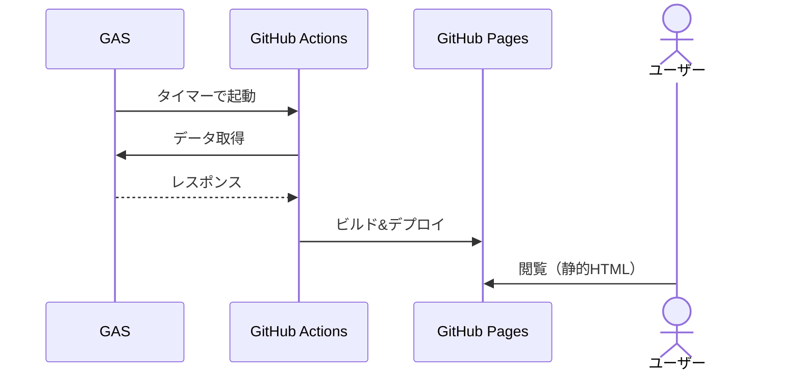
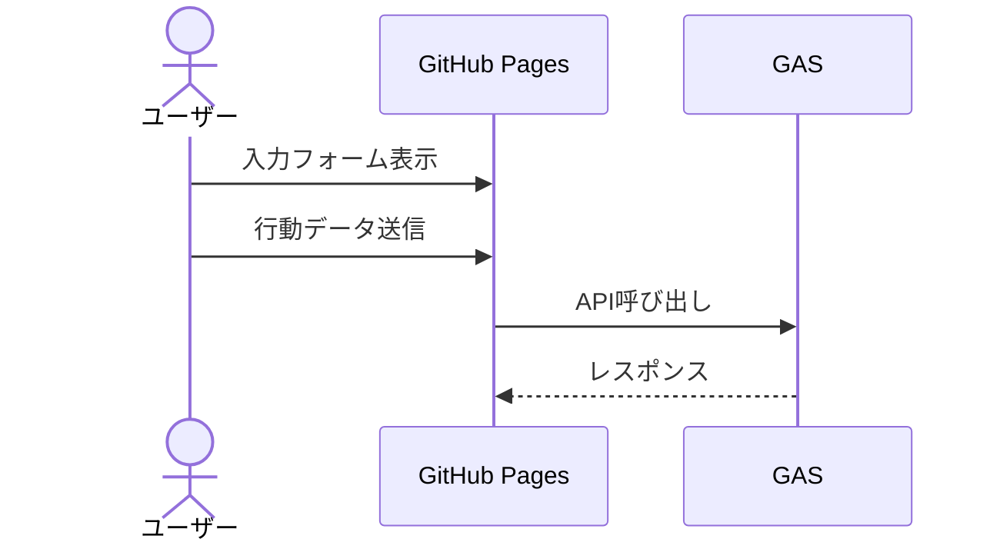

## この記事について
### 想定読者
- GitHub Pagesなどの静的サイトを持っている
- ユーザー参加型のコンテンツ（定期更新ゲームなど）を作ってみたいが、サーバー代はかけたくない

### やること
- 静的サイトの定期ビルドで動的っぽいコンテンツを実現する手段を紹介
  - READが多く、WRITEが少ないコンテンツ向け

### やらないこと
- 動的サイトの話
- 詳細な実装

---

# 定期ビルドによる疑似動的サイト
定期的にページビルドを繰り返す。
GASのタイマーでGitHub Actionsを呼び出すのが楽そう。

GitHub Actions側はGASのAPIを叩いてデータ取得し、そのデータを使ってページをビルドする。

例えばCGIの定期更新ゲームみたいな感じで、「毎日数回ユーザーの入力した行動が反映される」みたいなのは作りやすいかもしれない。

## 実際定期ゲーは作れるのか？
### 認証
- いきなりめんどくさい
- ユーザーごとの情報をuser-（id+passのハッシュ）.jsonに保持するのが楽か？
  - URLが知られると誰でも見れるのが怖い
- 仮に見られても問題ないデータにしておいて、どうしても見られるとアウトなものはGAS側に置くのがいいか

### 公開情報表示（定期ビルド）

- 数時間前の情報を表示することになるが、定期ゲーの性質上問題はないはず
- 表示自体は静的ページだから爆速
- 公開情報表示が遅い定期ゲーは結構あるので（データ自体の量が多いためか）、これはかなり嬉しいポイントかも

### 行動入力（バックエンド必須）

- ユーザー情報はuser.jsonでいい
- ユーザーの行動入力はGASでGET・POSTする必要があるのでここは遅い
- とはいえそこまで頻繁に更新することはないか？
- 典型的な定期ゲーの場合、ユーザーの複数行動入力を最後にまとめて送信する方式が落としどころだと思うが、コンテンツの性質によって最適解が変わるはず

### アカウント登録（バックエンド必須）
- どうしてもGASでやらざるを得ない
- 一回しかやらないし許容範囲か

# まとめ
- 定期ビルド方式はWRITEの書き込み・反映速度を犠牲にして、代わりにREADを高速・サーバー負荷ゼロにする方法とも言える
- READに比べてWRITEが極端に少ないコンテンツなら導入してもいいかも（例えばユーザーが自分の作品を投稿する場合等）
  - この場合、WRITEされたときにビルドしなおすというのもあり
